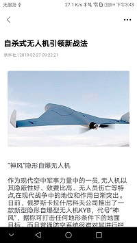
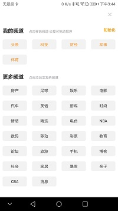
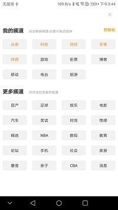
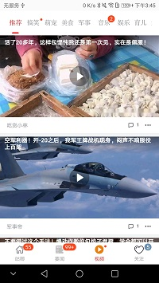
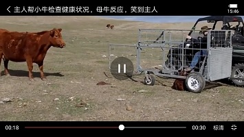
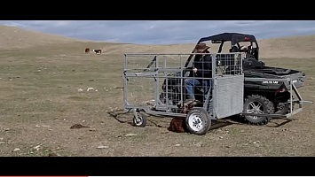
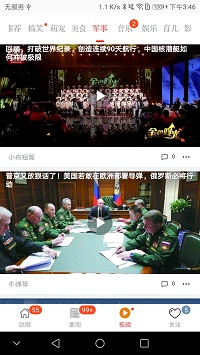
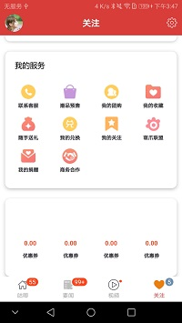
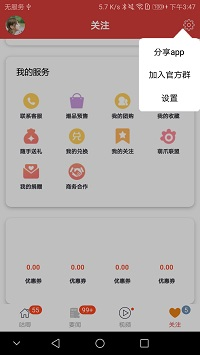
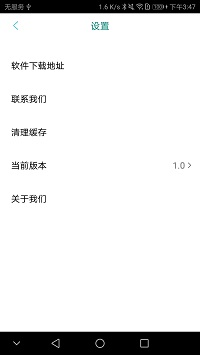

# GujiSmartNews

咕唧新闻平台V1.3.0
旨在做一款多类型阅读体验优美的新闻资讯的平台
首页精选分类性的新闻专区，包含图文、音视频、图文、导航入口、新闻直击阅读
可以随时随地加入新闻猜猜猜，专区内置咕唧币，更多权限，更多玩法
专门视频专区，一次看个够
个人中心，美观的界面，多类型，丰富的功能设计。设置分享，想看就看。
开源只为共同学习，请勿商用。问题或者指正请EMAIL:maiduoduo0@163.com

## 目前已完成的或者正在完成功能模块有：

   ####  启动页
	
		-广告：动态、静态。目前支持GIF形式动态广告和静态图文广告
		-静态图闻
		-应用宣传页
		

   ####  主页
	
		-底部导航搭建  SlidingTabLayout + ViewPager +Fragment
		-推荐、要闻、视频、娱乐、体育等  TabLayout + Fragment + ViewPager
		-多类型流畅列表展示  RecyclerView + BaseQuickAdapter + BaseViewHolder
		-列表数据的响应事件
		-级联界面
		-事件冲突处理
		-新闻直击阅读
		-频道定制
		-等（详见图片）

   ####  要闻
	
		-要闻 新闻预测，猜猜猜，等待揭晓。赢取咕唧币。
		-我的要闻
		-下拉刷新
		-加载更多
		
		
	

   ####  视频
	
		-推荐
		-搞笑
		-萌宠
		-美食
		-军事
		等
		-利用JZVDPlayer进行扩展视频播控
		-界面切换，视频播放停止，播放管理释放。
		-列表滑动距离范围，Item不可见播控停止，释放资源。
		-小窗模式
	
   ####  关注
	
		-头像、基本信息
		-折叠开窗列表联动效果
		-设置
		-好友、影响力、访客
		-个人小窝
		-我的钱包
		-我的订单
		-我的服务
		-等
		
   ####  新闻精选
   ####  新闻详情
   
   
	 
#### 技术要点(感谢项目中用到的开源框架开发者或开源机构)

		-沉浸式状态栏
		-圆角banner
		-多布局列表、头部、尾部
		-自定义下拉刷新布局。SwipeToLayout
		-类某团多页导航菜单，左右滑动，引导圆点
		-上下新闻条目切换条 -ViewFlipper
		-圆角图片
		-新闻详情：TextView加载HTML5内容，HtmlImageLoader+HtmlTagHandler+HtmlText等解析HTML文本和图片进行展示
		-新闻精选：CoordinatorLayout+AppBarLayout+Toolbar+NestedScrollView实现标题栏的伸缩效果
		-JZVDPlayer扩展实现视频界面播控，资源状态释放
		-SwipeToLoadLayout 可定制化刷新布局框架。
		-注入框架ButterKnife(黄油刀节省了人工时间成本)，快捷键快速注入View,事件监听等
		-retrofit2+rxjava+mvp等结合对业务及网络数据交换进行开发
		-FlycoTabLayout_Lib 导航页签快速集成，搭配Viewpager+Fragemnt
		-glide 图片高效配置及展示
		-Fresco FaceBook开源图片框架
		-等
		-其中使用的三方开源框架（后期会细化整理所有项目使用到的开源框架）
				

####  其他板块
		-分享app
		-拉起QQ分享
		-设置
		等

####  后续要完成

		- 新闻不同板块
		- 频道动态定制与首页联动
		- 视频详情
		- 我的要闻
		- 要闻详情预测
		- 视频、新闻类型条目的更多功能
		- 关注详情
		- 用户小窝
		- 消息推送  消息详情
		等，敬请期待

####  其中使用的三方开源框架（这里部分列举，后期会细化整理所有项目使用到的开源框架）
		  -BaseQuickAdapter
		  -Glide
		  -Fresco
		  -butterknife
		  -Retrofit2.0+rxandroid+rxjava+okhttp3
		  -FlycoTabLayout_Lib
		  -glide+fresco
		  -com.youth.banner:banner
		  -SwipeToLoadLayout
		  -jiaozivideoplayer
		  -xrecyclerview		  
		  等
		  -感谢开源，感谢项目中的开源方
		  
		  
		  		 	
#### 环境
		 -AndroidStudio3.2
			-Android Studio 3.2
			Build #AI-181.5540.7.32.5014246, built on September 18, 2018
			JRE: 1.8.0_152-release-1136-b06 amd64
			JVM: OpenJDK 64-Bit Server VM by JetBrains s.r.o
			Windows 10 10.0
		-SVN
		_gradle构建：gradle-4.6-all.zip
		
  
#### 声明

	# 此项目只作为平时开发练习及构思项目，请勿做其他任何商用，
	# 项目部分数据来源于 **SOHUNEWS Epet**
	# 如果项目中引入框架或者数据上有侵范行为，请联系我删除。Email:maiduoduo0@163.com
	
	# 感谢开源及开发性环境，才能使技术越走越远，内容越来越丰富，越来越规范。
	
	
	

###  咕唧新闻平台LOGO 

	
 #### 个人设计，请勿他用
 
  
	
	
	

### 咕唧新闻平台运行效果展示

## 初衷
          
		  - Android开发平时接触的东西很多，也很杂乱，通过这种方式能够将这些联系起来
		  - 学习之用，也是对这种类型应用的探索与热衷实现途径，学习好的点，用自己及网络世界的帮助，以此为纽带，好记性不如烂笔头。
		  - 项目写的可能不太好。一千个人眼中有一千个哈姆雷特，请老铁们多多指正。
		  - 不想当厨师的码农不是一个合格的老司机。
		  - 希望在日后静好岁月也好，波澜狂暴也好，坚持自我本心，热爱及热衷自己想要做的事情，追逐十七岁你最直击心底的那个信念
		  - 在座的一直发财，一直暴富，成为各个领域的大牛。

#### 关于LICENSE

	- 咕唧新闻项目只作为平时开发练习及构思交流项目，请勿做其他任何商用。
	- 咕唧新闻UI设计在参考主流类型平台结合自我设计+框架搭建+数据格式+网络库模式+MVP+业务+功能实现均为个人业余时间实现。
	- 归属解释权于dingcl,联系邮箱：maiduoduo0@163.com
	- 若想要转载等请联系我授权。转载请注明出处。互相学习与探讨。有任何问题请联系邮箱。

Copyright (C) dingcl, nanjCodeTeam,Inc. Open source codes for study only. Do not use for commercial purpose.

Licensed under the Apache License, Version 2.0 (the "License");
you may not use this file except in compliance with the License.
You may obtain a copy of the License at

   http://www.apache.org/licenses/LICENSE-2.0

Unless required by applicable law or agreed to in writing, software
distributed under the License is distributed on an "AS IS" BASIS,
WITHOUT WARRANTIES OR CONDITIONS OF ANY KIND, either express or implied.
See the License for the specific language governing permissions and
limitations under the License.